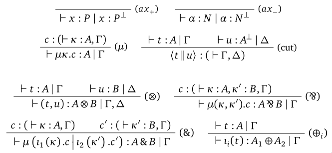
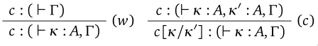

# Contexte et motivations

## Preuves et programmes

Deux approches historiques à la correspondance preuves-programmes :

- **Formules = types** (Curry, Howard, Griffin...) :
  \vspace{1em}
  \begin{center}
    preuve $\Longleftrightarrow$ programme
  \end{center}
  \vspace{1em}

- **Formules = spécifications** (Kleene, Kreisel, Krivine...) :
  \vspace{1em}
  \begin{center}
    preuve $\Longrightarrow$ programme
  \end{center}
  \vspace{1em}

## Curry-Howard

Isomorphisme **syntaxique** entre logique et calcul :

\begin{center}
  \begin{tabulary}{\textwidth}{C@{$\quad \Longleftrightarrow \quad$}C}
    Formule & Type \\
    Preuve & Programme \\
    Élimination des coupures & Exécution
  \end{tabulary}
\end{center}

\vspace{1em}

- On ne s'intéresse qu'aux programmes **bien typés**...
- ...vus comme une syntaxe de **termes** pour les preuves

## Curry-Howard

S'applique à de nombreuses logiques, incarnées dans divers systèmes de
déduction/langages de programmation :

\vspace{1em}

\begin{center}
  \begin{tabular}{|M{0.15}|M{0.35}|M{0.35}|}\hline
    & Intuitionniste & Classique \\ \hline
    Systèmes à la Hilbert & Logique Combinatoire & Logique Combinatoire Classique \\ \hline
    Déduction naturelle & $\lambda$-calcul (simplement typé, polymorphe...) & \lmc \\ \hline
    Calcul des séquents & Machine de Krivine & \alert{\SysL} \\ \hline
  \end{tabular}
\end{center}

\vspace{1em}

Mais aussi logique linéaire, logiques modales... et biensûr *théorie des types* !

## Réalisabilité

Interprétation "**sémantique**" de la logique dans le calcul :

\vspace{1em}

\begin{block}{Interprétation BHK (Brouwer-Heyting-Kolmogorov)}
  Une preuve de $A \Rightarrow B$ est une \textbf{fonction} qui prend une preuve de $A$ et renvoie une preuve de $B$.
\end{block}

- On s'autorise un espace de fonctions **plus riche** que celui des preuves !
- Permet de donner un contenu calculatoire à des théories **mathématiques** et pas seulement logiques

## Réalisabilité

S'applique à diverses théories intuitionnistes et classiques, interprétées dans divers langages de programmations :

\vspace{1em}

\begin{center}
  \begin{tabular}{|M{0.15}|M{0.35}|M{0.35}|}\hline
    & Intuitionniste & Classique \\ \hline
    Logique du 2\textsuperscript{nd} ordre & Système F & \alert{\SysL} \\ \hline
    % Arithmétique du 1\textsuperscript{er} ordre & Système T & ? \\ \hline
    Arithmétique du 2\textsuperscript{nd} ordre & Système F & $\lambda_c$-calcul \\ \hline
    Théorie des ensembles & ? & $\lambda_c$-calcul \\ \hline
    HoTT & Théorie des types cubiques & -- \\ \hline
  \end{tabular}
\end{center}

# Séquents $\Longleftrightarrow$ Machines abstraites 

## Calcul des séquents classique \hfill système $\mathsf{LK}$

\fontsize{10pt}{8}\selectfont
\vspace{1em}

### Groupe identité

\vspace{-1em}

\begin{mathpar}
  \prfbyaxiom{\irule{\mathrm{ax}}}{A \seq A}
  \and  
  \prftree[r]{\irule{\mathrm{cut}}}
    {\Gamma \seq A,\Delta}
    {\Gamma',A \seq \Delta'}
    {\Gamma,\Gamma' \seq \Delta,\Delta'}
\end{mathpar}

### Groupe structurel

\begin{columns}
  \begin{column}{0.3\textwidth}
    \begin{mathpar}
      \prftree[r]{\iruleR{x}}
        {\Gamma \seq \Delta, A, B, \Delta'}
        {\Gamma \seq \Delta, B, A, \Delta'}
      \\
      \prftree[r]{\iruleR{w}}
        {\Gamma \seq \Delta}
        {\Gamma \seq A, \Delta}
      \\
      \prftree[r]{\iruleR{c}}
        {\Gamma \seq A, A, \Delta}
        {\Gamma \seq A, \Delta}
    \end{mathpar}
  \end{column}
  \begin{column}{0.3\textwidth}
    \begin{mathpar}
      \prftree[r]{\iruleL{x}}
        {\Gamma, A, B, \Gamma' \seq \Delta}
        {\Gamma, B, A, \Gamma' \seq \Delta}
      \\
      \prftree[r]{\iruleL{w}}
        {\Gamma \seq \Delta}
        {\Gamma, A \seq \Delta}
      \\
      \prftree[r]{\iruleL{c}}
        {\Gamma, A, A \seq \Delta}
        {\Gamma, A \seq \Delta}
    \end{mathpar}
  \end{column}
\end{columns}

\vspace{1em}

## Calcul des séquents classique \hfill système $\mathsf{LK}$

\fontsize{10pt}{8}\selectfont

### Groupe logique

\begin{columns}
  \color{term}
  \begin{column}{0.3\textwidth}
    \begin{mathpar}
      \prftree[r]{\iruleR{\neg}}
        {\Gamma,A \seq \Delta}
        {\Gamma \seq \neg A,\Delta}
      \\
      \prftree[r]{\iruleR{\lto}}
        {\Gamma,A \seq B,\Delta}
        {\Gamma \seq A \lto B,\Delta}
      \\
      \prftree[r]{\iruleR{\land}}
        {\Gamma \seq A,\Delta}
        {\Gamma \seq B,\Delta}
        {\Gamma \seq A \land B,\Delta}
      \\
      \prftree[r]{\irule{\lor R_i}}
        {\Gamma \seq A_i,\Delta}
        {\Gamma \seq A_1 \lor A_2,\Delta}
    \end{mathpar}
  \end{column}
  \color{context}
  \begin{column}{0.3\textwidth}
    \begin{mathpar}
      \prftree[r]{\iruleL{\neg}}
          {\Gamma \seq A,\Delta}
          {\Gamma,\neg A \seq \Delta}
      \\
      \prftree[r]{\iruleL{\lto}}
        {\Gamma \seq A,\Delta}
        {\Gamma',B \seq \Delta'}
        {\Gamma,\Gamma',A \lto B \seq \Delta,\Delta'}
      \\
      \prftree[r]{\irule{\land L_i}}
        {\Gamma,A_i \seq \Delta}
        {\Gamma,A_1 \land A_2 \seq \Delta}
      \\
      \prftree[r]{\iruleL{\lor}}
        {\Gamma,A \seq \Delta}
        {\Gamma,B \seq \Delta}
        {\Gamma,A \lor B \seq \Delta}
    \end{mathpar}
  \end{column}
\end{columns}

\vspace{1em}

## Machines abstraites \hfill $\bar{\lambda}\mu\tilde{\mu}$-calcul

\fontsize{8pt}{8}\selectfont
\vspace{1em}

### Termes

\vspace{-1em}

$$
\color{term}
\def\arraystretch{1.2}
\begin{array}{rclr}
  t,u & ::= & x & \text{(Variable)} \\
  & ∣ & μα.c & \text{(Abstraction de contexte)} \\
  & ∣ & \CTneg{e} & \text{(Réification de contexte)} \\
  & ∣ & \CTimpl{x}{t} & \text{(Fonction)} \\
  & ∣ & \CTwith{α₁}{c₁}{α₂}{c₂} & \text{(Paire)} \\
  & ∣ & \CTplusone{t} ∣ \CTplustwo{t} & \text{(Injections)} \\
\end{array}
$$

### Contextes d'évaluation

\vspace{-1em}

$$
\color{context}
\def\arraystretch{1.2}
\begin{array}{rclr}
  e & ::= & α & \text{(Co-variable)} \\
  & ∣ & \tilde{μ}x.c & \text{(Abstraction de terme)} \\
  & ∣ & \CEneg{α}{c} & \text{(Récupération de contexte)} \\
  & ∣ & \CEimpl{t}{e} & \text{(Argument)} \\
  & ∣ & \CEwithone{e} ∣ \CEwithtwo{e} & \text{(Projections)} \\
  & ∣ & \CEplus{x₁}{c₁}{x₂}{c₂} & \text{(Pattern matching)} \\
\end{array}
$$

### Commandes

\vspace{-1em}

$$
c ~::=~ \cut{t}{e}
$$

## Fusion ! \hfill $\approx$ système $\mathsf{LK}_{μ\tilde{μ}}$

\fontsize{9pt}{8}\selectfont
\vspace{1em}

### Groupe identité

\vspace{-1em}

\begin{mathpar}
  {\color{term}
  \prfbyaxiom{\iruleR{\mathrm{ax}}}{x : A \seq x : A ∣}}
  \and
  {\color{context}
  \prfbyaxiom{\iruleL{\mathrm{ax}}}{∣ α : A \seq α : A}}
  \\
  \prftree[r]{\irule{\mathrm{cut}}}
    {\color{term} \Gamma \seq t : A ∣ \Delta}
    {\color{context} \Gamma' ∣ e : A \seq \Delta'}
    {\cut{t}{e} : (\Gamma,\Gamma' \seq \Delta,\Delta')}
\end{mathpar}

### Groupe structurel

\begin{columns}
  \begin{column}{0.45\textwidth}
    \begin{mathpar}
      \prftree[r]{\iruleR{x}}
        {c : (\Gamma \seq \Delta, α : A, β : B, \Delta')}
        {c : (\Gamma \seq \Delta, β : B, α : A, \Delta')}
      \\
      \prftree[r]{\iruleR{w}}
        {c : (\Gamma \seq \Delta)}
        {c : (\Gamma \seq α : A, \Delta)}
      \\
      \prftree[r]{\iruleR{c}}
        {c : (\Gamma \seq α : A, β : A, \Delta)}
        {\substE{c}{α}{β} : (\Gamma \seq α : A, \Delta)}
    \end{mathpar}
  \end{column}
  \begin{column}{0.45\textwidth}
    \begin{mathpar}
      \prftree[r]{\iruleL{x}}
        {c : (\Gamma, x : A, y : B, \Gamma' \seq \Delta)}
        {c : (\Gamma, y : B, x : A, \Gamma' \seq \Delta)}
      \\
      \prftree[r]{\iruleL{w}}
        {c : (\Gamma \seq \Delta)}
        {c : (\Gamma, x : A \seq \Delta)}
      \\
      \prftree[r]{\iruleL{c}}
        {c : (\Gamma, x : A, y : A \seq \Delta)}
        {\substT{c}{x}{y} : (\Gamma, x : A \seq \Delta)}
    \end{mathpar}
  \end{column}
\end{columns}

\vspace{1em}

## Fusion ! \hfill $\approx$ système $\mathsf{LK}_{μ\tilde{μ}}$

\fontsize{8pt}{9}\selectfont

### Groupe logique

\begin{mathpar}
  \color{term}
    \prftree[r]{\iruleR{\neg}}
      {\Gamma ∣ e : A \seq \Delta}
      {\Gamma \seq \CTneg{e} : \neg A ∣ \Delta} \and
  \color{context}
    \prftree[r]{\iruleL{\neg}}
      {c : (\Gamma \seq α : A,\Delta)}
      {\Gamma ∣ \CEneg{α}{c} : \neg A \seq \Delta}
  \\
  \color{term}
    \prftree[r]{\iruleR{\lto}}
      {\Gamma, x : A \seq t : B ∣ \Delta}
      {\Gamma \seq \CTimpl{x}{t} : A \lto B ∣ \Delta} \and
  \color{context}
    \prftree[r]{\iruleL{\lto}}
      {\Gamma \seq t : A ∣ \Delta}
      {\Gamma' ∣ e : B \seq \Delta'}
      {\Gamma,\Gamma' ∣ \CEimpl{t}{e} : A \lto B \seq \Delta,\Delta'}
  \\
  \color{term}
    \prftree[r]{\iruleR{\land}}
      {c₁ : (\Gamma \seq α₁ : A,\Delta)}
      {c₂ : (\Gamma \seq α₂ : B,\Delta)}
      {\Gamma \seq \CTwith{α₁}{c₁}{α₂}{c₂} : A \land B ∣ \Delta} \and
  \color{context}
    \prftree[r]{\irule{\land L_i}}
      {\Gamma ∣ e : A_i \seq \Delta}
      {\Gamma ∣ π_i · {e} : A_1 \land A_2 \seq \Delta}
  \\
  \color{term}
    \prftree[r]{\irule{\lor R_i}}
      {\Gamma \seq t : A_i ∣ \Delta}
      {\Gamma \seq ι_i(t) : A_1 \lor A_2 ∣ \Delta} \and
  \color{context}
    \prftree[r]{\iruleL{\lor}}
      {c₁ : (\Gamma, x₁ : A \seq \Delta)}
      {c₂ : (\Gamma, x₂ : B \seq \Delta)}
      {\Gamma ∣ \CEplus{x₁}{c₁}{x₂}{c₂} : A \lor B \seq \Delta}
\end{mathpar}

\vspace{1em}

## Élimination des coupures $\Longleftrightarrow$ Exécution

Calcul défini comme **interaction** entre un terme $\color{term} t$ et son contexte
$\color{context} e$ dans la commande $\cut{t}{e}$ :

\vspace{0.5em}

### $β$-réduction

\fontsize{8.5pt}{9}\selectfont
\vspace{-2em}

\begin{align*}
\hspace{-2em}
  \cut{\CTimpl{x}{t}}{\CEimpl{u}{e}}
  &\red{β}
  \cut{u}{\tilde{μ}x.\cut{t}{e}}
  & \text{(Fonction/Argument)}
  \\
  \cut{\CTwith{α₁}{c₁}{α₂}{c₂}}{\CEwithone{e}}
  &\red{β}
  \substE{c₁}{e}{α₁}
  & \text{(Paire/Projection)}
  \\
  \cut{\CTplusone{t}}{\CEplus{x₁}{c₁}{x₂}{c₂}}
  &\red{β}
  \substT{c₁}{t}{x₁}
  & \text{(Injection/Pattern-matching)}
  \\
  ⋮
\end{align*}

### $μ$-réduction

\vspace{-2em}

\begin{align*}
  \cut{μα.c}{e} &\red{μ} \substE{c}{e}{α} \\
  \cut{t}{\tilde{μ}x.c} &\red{μ} \substT{c}{t}{x}
\end{align*}

## Le problème de la confluence

$\red{μ}$ **non-confluente** à cause de la *paire critique* :

\vspace{-1em}
$$
\substE{c}{\tilde{μ}x.c'}{α} \xleftarrow{?} \cut{μα.c}{\tilde{μ}x.c'} \xrightarrow{?} \substT{c'}{μα.c}{x}
$$

Deux solutions possibles :

1. (Curien/Herbelin) choix *global* en fixant une **stratégie d'évaluation** :

\vspace{-1em}
$$
\substE{c}{\tilde{μ}x.c'}{α} \xleftarrow{\mathsf{cbv}} \cut{μα.c}{\tilde{μ}x.c'} \xrightarrow{\mathsf{cbn}} \substT{c'}{μα.c}{x}
$$

2. (Munch-Maccagnoni) choix *local* en fixant l'ordre d'évaluation dans les **constructions du langage** (termes/types)

# Focalisation

## Un peu de logique linéaire \hfill système $\mathsf{MALL}$

### Formules

\vspace{-1em}
$$
\def\arraystretch{1.2}
\begin{array}{rclr}
  A,B & ::= & X ∣ X^⊥ & \text{(Atomes)} \\
  & ∣ & A \otimes B ∣ A \with B & \text{(Conjonctions)} \\
  & ∣ & A \oplus B ∣ A \parr B & \text{(Disjonctions)} \\
\end{array}
$$

### Négation

$\cdot^\bot$ définie inductivement par dualité de De Morgan :

\vspace{-2em}
\begin{align*}
  (A \otimes B)^\bot &\triangleq A^\bot \parr B^\bot & (A \parr B)^\bot &\triangleq A^\bot \otimes B^\bot \\
  (A \oplus B)^\bot &\triangleq A^\bot \with B^\bot & (A \with B)^\bot &\triangleq A^\bot \oplus B^\bot \\
\end{align*}
\vspace{-3em}

## Un peu de recherche de preuves

En programmation logique, Andreoli découvre que la recherche d'une preuve peut être organisée en une **alternance** de deux phases :

- **\color{neg} Asynchrone** : décomposition de toutes les formules **\color{neg} négatives** *dès que possible*
- **\color{pos} Synchrone** : choix d'une formule **\color{pos} positive**, et décomposition de toutes ses sous-formules jusqu'à la prochaine phase asynchrone (c'est la \alert{focalisation})

Cette nouvelle dualité reflète l'**inversibilité** des règles d'introduction des connecteurs.

---

### Formules

\vspace{-1em}
$$
\def\arraystretch{1.2}
\begin{array}{rclr}
  A,B & ::= & {\color{pos} X} ∣ {\color{neg} X^⊥} & \text{(Atomes)} \\
  & ∣ & {\color{pos} A \otimes B} ∣ {\color{neg} A \with B} & \text{(Conjonctions)} \\
  & ∣ & {\color{pos} A \oplus B} ∣ {\color{neg} A \parr B} & \text{(Disjonctions)} \\
\end{array}
$$

### Négation

$\cdot^\bot$ définie inductivement par dualité de De Morgan :

\vspace{-2em}
\begin{align*}
  {\color{pos} (A \otimes B)}^\bot &\triangleq {\color{neg} A^\bot \parr B^\bot}
  &
  {\color{neg} (A \parr B)}^\bot &\triangleq {\color{pos} A^\bot \otimes B^\bot}
  \\
  {\color{pos} (A \oplus B)}^\bot &\triangleq {\color{neg} A^\bot \with B^\bot}
  &
  {\color{neg} (A \with B)}^\bot &\triangleq {\color{pos} A^\bot \oplus B^\bot}
\end{align*}

## Polarité $\Longleftrightarrow$ Ordre d'évaluation

- Munch-Maccagnoni interprète cette dualité comme celle entre évaluations $\color{pos} \text{stricte } (\mathsf{cbv})$ et $\color{neg} \text{paresseuse } (\mathsf{cbn})$
- Réduction **focalisante** basée sur une syntaxe de **valeurs polarisées** :

\vspace{-2em}
\begin{align*}
  V &~::=~ {\color{pos} V_+} ∣ {\color{neg} t_-} \\
  {\color{pos} V_+} &{\color{pos} ~::=~ x ∣ \Ctensor{V}{V} ∣ ι_i(V)} \\
  {\color{neg} t_-} &{\color{neg} ~::=~ α ∣ \Cparr{κ}{κ'}{c} ∣ \Cwith{κ₁}{c₁}{κ₂}{c₂}}
\end{align*}

- Formes normales $\Longleftrightarrow$ Preuves focalisées

**Remarque** : on a remplacé la dualité \term{terme}/\context{contexte} par \ppos{positif}/\pneg{négatif}, on peut alors oublier la distinction \term{droite}/\context{gauche} des séquents.

## Système $\mathsf{LK_{pol}}$

\vspace{1em}
{width=65%}

# Réalisabilité classique

## Orthogonalité

<!-- On définit une notion d'**orthogonalité** entre $\color{pos} \text{termes positifs}$ (les termes du \lmmtc) et $\color{neg} \text{termes négatifs}$ (les contextes du \lmmtc), qui intuitivement correspond au fait qu'on peut **observer leur interaction**. -->

\begin{definition}[Observation]
  Une \emph{observation} $\indep$ est un ensemble de commandes closes, qui est clos par anti-réduction :
  $$ c \red{} c', c' \in \indep \Longrightarrow c \in \indep$$
\end{definition}

\begin{definition}[Orthogonalité]
  $\ppos{t_+}$ est \emph{orthogonal} à $\pneg{t_-}$ (noté $\ppos{t_+} \indep \pneg{t_-}$) ssi $\pcut{t_+}{t_-} \in \indep$.
\end{definition}

\begin{definition}[Orthogonal]
  L'\emph{orthogonal} $T^\bot$ d'un ensemble de termes de même polarité $T$ est défini par :
  $$T^\bot \triangleq \{u \mid \forall t \in T, t \indep u\}$$
\end{definition}

## Comportements

On peut alors interpréter les connecteurs de la logique par des **comportements**, c'est-à-dire des ensembles de termes de même polarité **clos par biorthogonal** $\cdot^{\bot\bot}$ :

\vspace{-2em}
\begin{align*}
  \ppos{|A \otimes B|} &\triangleq (|A| \times |B|)^{\bot\bot}
  &
  \pneg{|A \parr B|} &\triangleq (|A^\bot| \times |B^\bot|)^{\bot}
  \\
  \ppos{|A \oplus B|} &\triangleq (|A| + |B|)^{\bot\bot}
  &
  \pneg{|A \with B|} &\triangleq (|A^\bot| + |B^\bot|)^{\bot}
\end{align*}

avec

\vspace{-2em}
\begin{align*}
  T \times U &\triangleq \{\ppos{\Ctensor{t}{u}} ∣ t \in T, u \in U\} \\
  T + U &\triangleq \{\ppos{\iota_1(t)} \mid t \in T\} \cup \{\ppos{\iota_2(u)} \mid u \in U\}
\end{align*}

\begin{definition}[Relation de réalisabilité]
  On dit que $t$ \emph{réalise} $A$ (noté $t ⊩ A$) lorsque $t ∈ |A|$.
\end{definition}

## Adéquation

\begin{theorem}[Lemme d'adéquation]
  Soit $t$ un terme typable dans $\mathsf{LK_{pol}}$ par $\seq t : B ∣ κ₁ : A₁, …, κ_n : A_n$. Alors pour tous termes clos $u₁, …, u_n$, on a :
  $$u₁ ⊩ A₁^⊥, …, u_n ⊩ A_n^⊥ \quad \Longrightarrow \quad t[\vec{u_i}/\vec{κ_i}] ⊩ B$$
\end{theorem}

## Applications du lemme d'adéquation

- Propriété de **constructivité** des connecteurs (notamment propriété de la disjonction pour $\oplus$)
- **Normalisation** (faible)
- **Paramétricité** (en passant au second ordre)

---

\centering\huge Merci !